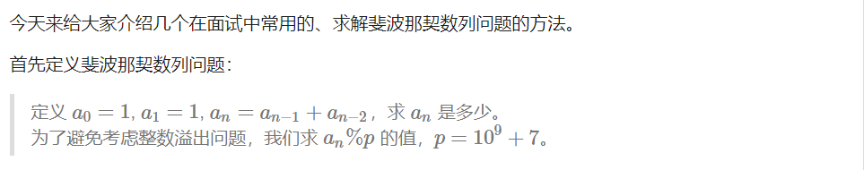
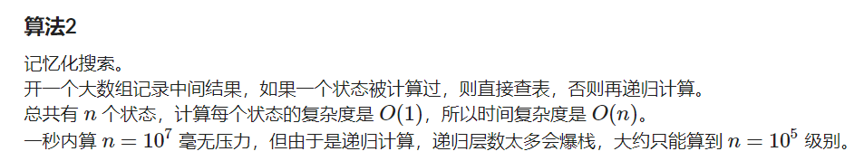
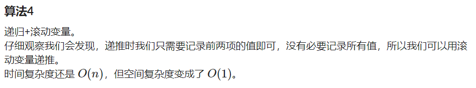
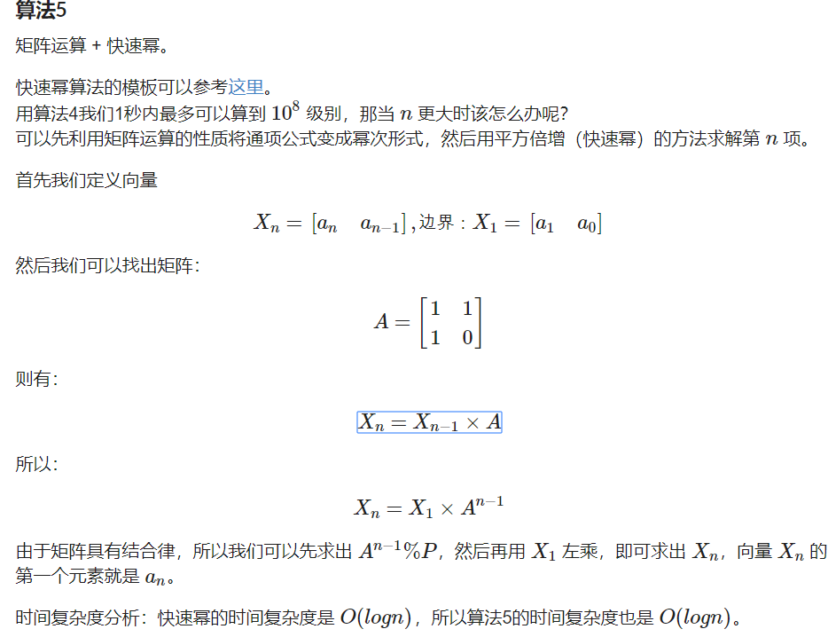

C++ 代码

```c++
const int MOD = 1000000007;
int f(int n)
{
    if (n <= 1) return 1;
    return (f(n - 1) + f(n - 2)) % MOD;
}
```



C++ 代码

```c++
const int N = 100000, MOD = 1000000007;
int a[N];
int f2(int n)
{
    if (a[n]) return a[n];
    if (n <= 1) return 1;
    a[n] = f2(n - 1) + f2(n - 2);
    a[n] %= MOD;
    return a[n];
}
```


C++代码

```c++
const int N = 100000000, MOD = 1000000007;
int f3(int n)
{
    a[0] = a[1] = 1;
    for (int i = 2; i <= n; i ++ )
    {
        a[i] = a[i - 1] + a[i - 2];
        a[i] %= MOD;
    }
    return a[n];
}
```



C++代码：

```c++
const int MOD = 1000000007;
int f4(int n)
{
    int x, y, z;
    x = y = 1;
    for (int i = 2; i <= n; i ++ )
    {
        z = (x + y) % MOD;
        x = y;
        y = z;
    }
    return z;
}
```



C++代码

```c++
#include <cstdio>

#include <cstring>

#include <iostream>

#include <algorithm>

#include <ctime>

using namespace std;

void mul(int a, int b, int c)
{
    int temp = {{0, 0}, {0, 0}};
    for (int i = 0; i < 2; i ++ )
        for (int j = 0; j < 2; j ++ )
            for (int k = 0; k < 2; k ++ )
            {
                long long x = tempi + (long long)ai * bk;
                tempi = x % MOD;
            }
    for (int i = 0; i < 2; i ++ )
        for (int j = 0; j < 2; j ++ )
            ci = tempi;
}

int f_final(long long n)
{
    int x[2] = {1, 1};

int a[2][2] = {{1, 1}, {1, 0}};

int res[][2] = {{1, 0}, {0, 1}};
int t[][2] = {{1, 1}, {1, 0}};
long long k = n - 1;
while (k)
{
    if (k&1) mul(res, t, res);
    mul(t, t, t);
    k >>= 1;
}

int c[2] = {0, 0};
for (int i = 0; i < 2; i ++ )
    for (int j = 0; j < 2; j ++ )
    {
        long long r = c[i] + (long long)x[j] * res[i][j];
        c[i] = r % MOD;
    }

return c[0];
}

int main()
{
    long long n ;

    cin >> n;
    cout << f_final(n) << endl;
    
    return 0;

}
```


